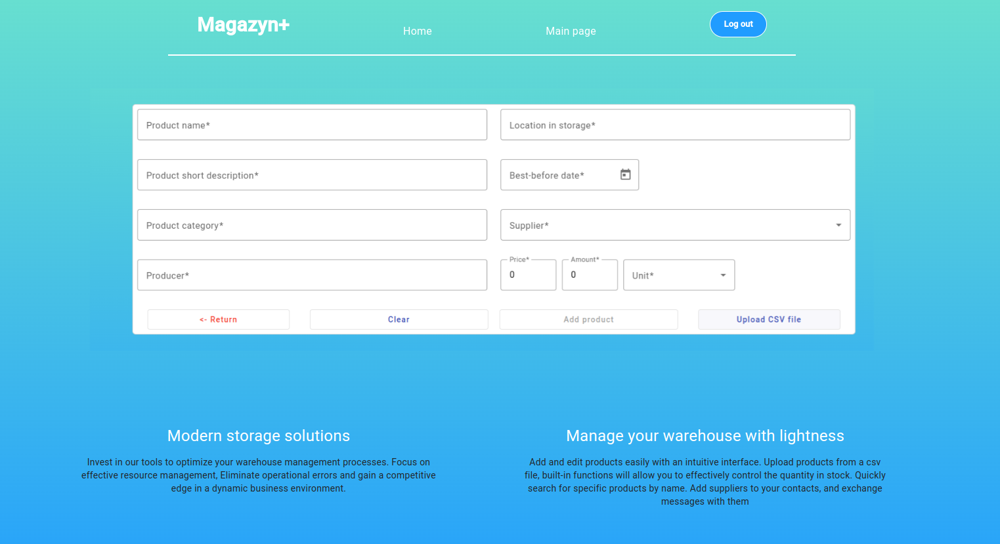
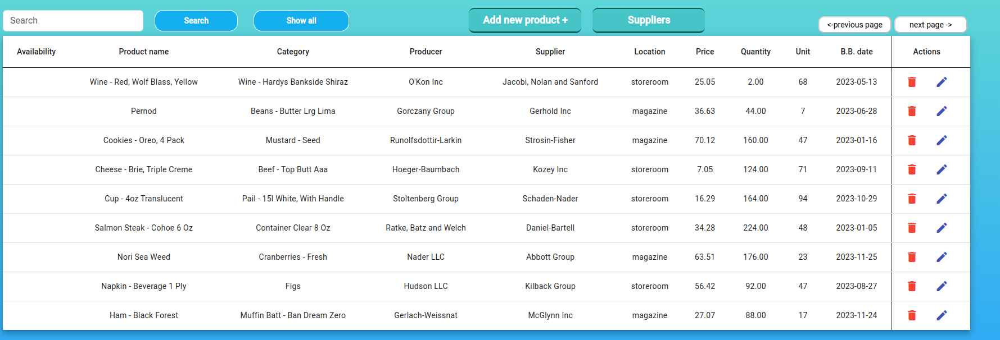
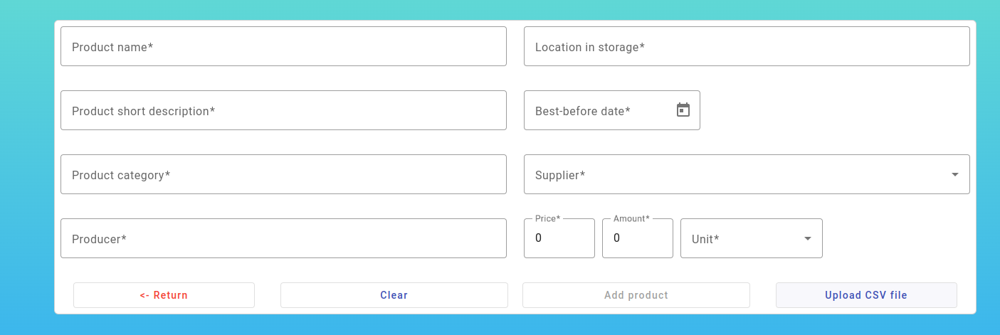
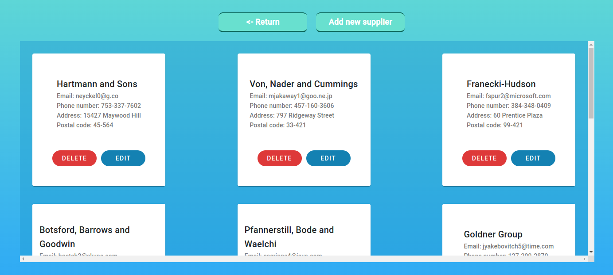

# Magazynplus
This repository contains the latest source code of the magazynplus app - the warehouse management app written in Java programming language and Type script

## Application designed to run in the docker 
## Technologies Used
1. `Spring boot`
2. `Spring Webflux`
3. `Spring cloud`
4. `Spring Jpa`
2. `Hibernate`
3. `PostgreSql` and `MySql`
4. `Kafka broker and zippking server` - sending messages between services and creating an account in the database after receiving a message from keycloak
5. Security - `Spring security` and `Keycloak` - open source implementation of the OAuth2 protocol. 
6. Frontend - `Angular`
7. `opencsv` - Mapping fields from csv file to objects
## Architecture
The application runs on a `microservices` architecture.
All services are connected to the `discovery server`, and the frontend sends queries to only one source - `api gateway`,
which forwards queries to the appropriate rest controllers.
## How to run the application using Docker

1. Download repository by `git clone https://github.com/ArcziDudu/magazynplus.git`
2. Run `mvn clean package` in `magazynplus` folder to build the applications and create the docker image locally.
3. Go to `keycloak-spi-listener`directory and run `mvn clean package` - keycloak required custom listener
4. Configuring a hosts file on your machine - This step is necessary because the address of Keycloak server is different 
depending on the point of view. From the point of view of an app that is running in the web browser it’ll be http://localhost:8080, 
but from the perspective of backend application that is running inside the Docker network it will be http://keycloak:8080.
To overcome it above config is necessary. So please find it:
- On windows: C:\Windows\System32\drivers\etc\hosts run as administrator and add following line: 127.0.0.1	keycloak
- On Linux(ubuntu): Etc/hosts, open in terminal by `sudo nano hosts` and add following line: 127.0.0.1	keycloak, ctrl +o, ctrl +x

- `Without this step keyckloak will not properly verify the token from api requests !`
5. Run `docker compose up` in main directory to run all of the services
6. Wait a while until all services are up and running and the services connect to the discovery server
7. In your browser, go to `localhost:4200` and register new account
 

## What you can do in the app

 

In main Page section you can add your first products manualy or by upload file e.g. a ready-made product file
included in the package named `example-products.csv`or create your own based on it.
 
 
The product service works in such a way that if the product is exactly the same based on all fields except the quantity
then no new product is created, only the quantity of the new product is added to the existing one.
If the product is completely new then it is created in the database.
You can check this mechanism by adding products several times from the supplied exapmple-products.csv file and observe the changing number of individual products.
When adding a new product, you can also select the supplier you have in your contacts, 
if you do not have any contacts then the supplier information in the added product will remain empty
 
 
The main page will display products using a pagination mechanism - 10 products on one page,
the subsequent pages with products are accessed by buttons on the right.
On the left side there is an input to search for products by name and a `find all` button
 

 
Each product can be deleted or edited. Editing works in such a way that through RouteSnapshot in angular,
information about the edited specific product is delivered to the edit page and there you can change specific product fields
 
 
in the main page there is a `suppliers` button - just there you can find contacts to suppliers,
you can add a new one or provide multiple contacts by uploading a ready-made csv file e.g. `Suppliers.csv` from repository folder
On the supplier page, there are mechanisms such as deleting, editing a contact
 

 
 

